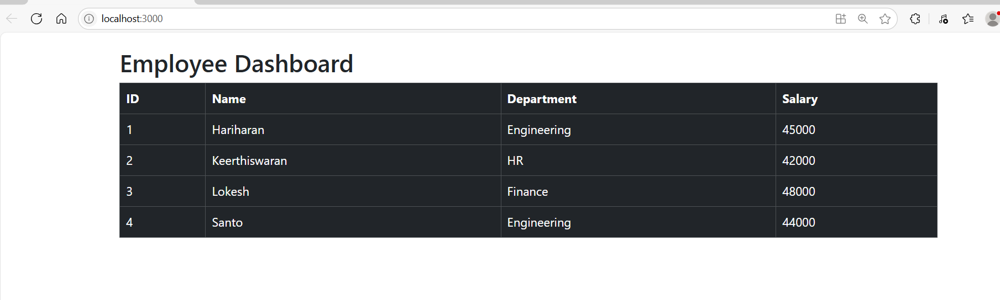
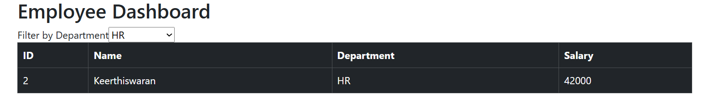
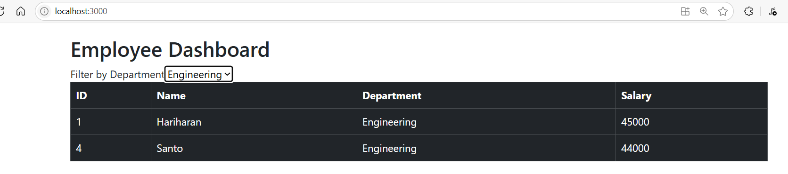
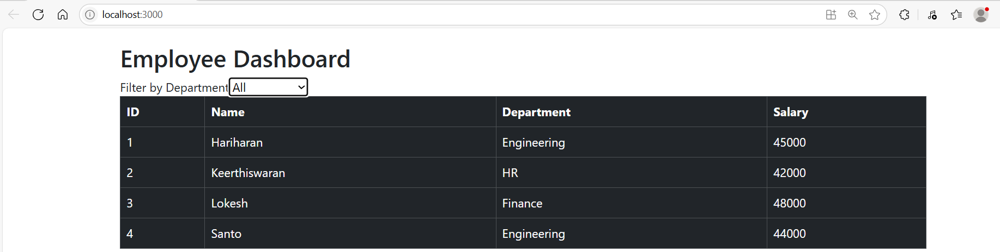
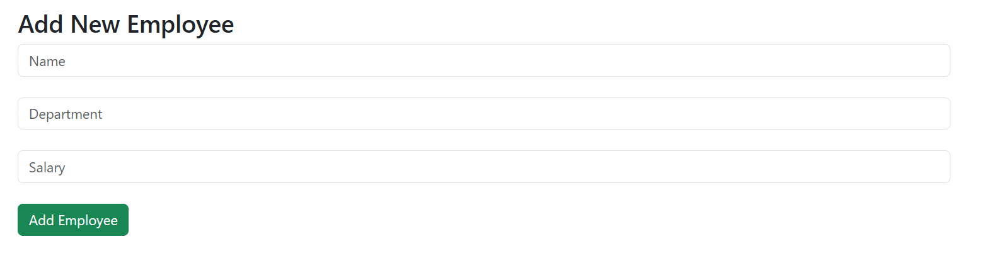
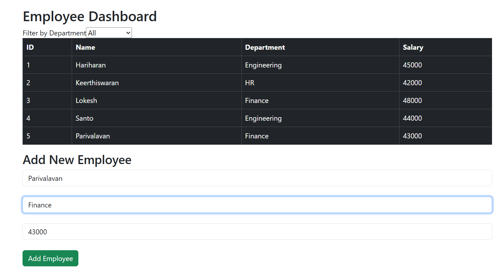
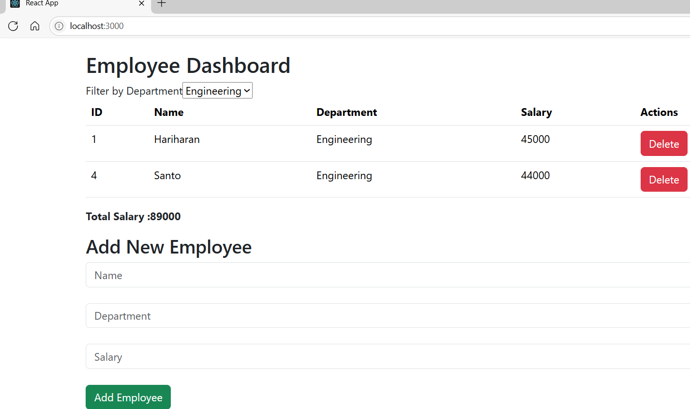

# Employee CRUD in Memory in React Js

create a new Project npx create-react-app@latest sample-employe-crudapp

Create a new JSX file with the name of employeecrud.jsx

With an employee cre With an employee crud jsx 
```jsx
import React, { useState } from "react";
const initialEmployees = [
  { id: 1, name: "Hariharan", department: "Engineering", salary: 45000 },
  { id: 2, name: "Keerthiswaran", department: "HR", salary: 42000 },
  { id: 3, name: "Lokesh", department: "Finance", salary: 48000 },
  { id: 4, name: "Santo", department: "Engineering", salary: 44000 },
];

export default function EmployeeCRUD() {
     return (
    <>
      <div style={{ padding: "20px" }}>
        <h2>Employee Dashboard</h2>
       
        <table className="table table-dark table-bordered">
          <thead>
            <tr>
              <th>ID</th>
              <th>Name</th>
              <th>Department</th>
              <th>Salary</th>
            </tr>
          </thead>
          <tbody>
            {initialEmployees.map((emp) => (
              <tr key={emp.id}>
                <td>{emp.id}</td>
                <td>{emp.name}</td>
                <td>{emp.department}</td>
                <td>{emp.salary}</td>
              </tr>
            ))}
          </tbody>
        </table>
      </div>
    </>
  );
}
```
### output



# Let us perform a filter the employees based on the department we select in Dropdownlist

 2. React Component and State Setup
```jsx
export default function EmployeeCRUD() {
  const [employees, setemployees] = useState(initialEmployees);
}
```
## declare a state variable:

**employees:** holds the current list of employees

**setemployees:** function to update that list

It's initialized with the initialEmployees array.

### Department Filter State
```jsx
const [filterDept, setFilterDept] = useState("All");
```
This state tracks the selected department filter.

"All" means no filter is applied.

The user can change this value to filter employees by a specific department.

### Getting unique Departments from initialEmployees Array
```jsx
const departments = [
    "All",
    ...new Set(initialEmployees.map((emp) => emp.department)),
  ];
``` 

Here you create a list of all unique departments from the initial employees list.

🔍 Breakdown:
initialEmployees.map(...) extracts all departments from the array.

new Set(...) removes duplicates.

Spread ... is used to convert the Set back into an array.

"All" is added to the front of the array to allow viewing all employees.

## Example Result 
```js
["All", "Engineering", "HR", "Finance"]
```
##  Filtering the Employee List
```jsx
 const filteredEmployees =
    filterDept === "All"
      ? employees
      : employees.filter((emp) => emp.department === filterDept);
```
This logic creates a filtered list of employees to be displayed.

💡 Logic:
If filterDept === "All", then show all employees.

Otherwise, only include employees whose department matches the selected filterDept.


## To display the label and dropdownList add the below code in html Format
```html
<label>Filter by Department</label>
        <select
          value={filterDept}
          onChange={(e) => setFilterDept(e.target.value)}
        >
          {departments.map((dept, idx) => (
            <option key={idx} vlaue={dept}>
              {dept}
            </option>
          ))}
        </select>

```

Then Modify the table from initialEmployees to FilteredEmployees

## Below is Final code:
```jsx
import React, { useState } from "react";
const initialEmployees = [
  { id: 1, name: "Hariharan", department: "Engineering", salary: 45000 },
  { id: 2, name: "Keerthiswaran", department: "HR", salary: 42000 },
  { id: 3, name: "Lokesh", department: "Finance", salary: 48000 },
  { id: 4, name: "Santo", department: "Engineering", salary: 44000 },
];
export default function EmployeeCRUD() {
    //we are assiging the initial 
  const [employees, setemployees] = useState(initialEmployees);
  
  const [filterDept, setFilterDept] = useState("All");
  const departments = [
    "All",
    ...new Set(initialEmployees.map((emp) => emp.department)),
  ];

  const filteredEmployees =
    filterDept === "All"
      ? employees
      : employees.filter((emp) => emp.department === filterDept);
  return (
    <>
      <div style={{ padding: "20px" }}>
        <h2>Employee Dashboard</h2>
        <label>Filter by Department</label>
        <select
          value={filterDept}
          onChange={(e) => setFilterDept(e.target.value)}
        >
          {departments.map((dept, idx) => (
            <option key={idx} vlaue={dept}>
              {dept}
            </option>
          ))}
        </select>
        <table className="table table-dark table-bordered">
          <thead>
            <tr>
              <th>ID</th>
              <th>Name</th>
              <th>Department</th>
              <th>Salary</th>
            </tr>
          </thead>
          <tbody>
            {filteredEmployees.map((emp) => (
              <tr key={emp.id}>
                <td>{emp.id}</td>
                <td>{emp.name}</td>
                <td>{emp.department}</td>
                <td>{emp.salary}</td>
              </tr>
            ))}
          </tbody>
        </table>
      </div>
    </>
  );
}
```

## output







## Now let us add new Employee 

for that we can use form ,formData and other below things

```jsx
const [formData, setFormData] = useState({name: "",department: "",salary: "",});

const handleChange = (e) => {
    setFormData({ ...formData, [e.target.name]: e.target.value });
  };

  const addEmployee = (e) => {
    e.preventDefault();
    const newEmployee = {
      id: employees.length + 1,
      name: formData.name,
      department: formData.department,
      salary: parseFloat(formData.salary),
    };
    setemployees([...employees, newEmployee]);
    setFormData({ name: "", department: "", salary: "" });
  };
 ```

**add the below code after your table**

 ```html
<h3> Add New Employee</h3>
        <form onSubmit={addEmployee}>
          <input
            type="text"
            name="name"
            placeholder="Name"
            className="form-control"
            value={formData.name}
            onChange={handleChange}
            required
          />
          <br />
          <input
            type="text"
            name="department"
            placeholder="Department"
            className="form-control"
            value={formData.department}
            onChange={handleChange}
            required
          />
          <br />
          <input
            type="number"
            name="salary"
            placeholder="Salary"
            className="form-control"
            value={formData.salary}
            onChange={handleChange}
            required
          />
          <br />
          <button type="submit" className="btn btn-success">
            Add Employee
          </button>
        </form>
 ```





## Let us perform Delete Employee
```jsx

//we are not actually deleting the Employee from array instea we are hiding the Employees
const deleteEmployee = (id) => {
    setEmployees(employees.filter((emp) => emp.id !== id));
  };

//To Calculate the Total salary based filteredEmployees and display below the table
  const totalSalary = filteredEmployees.reduce(
    (sum, emp) => sum + emp.salary,
    0
  );

  ```

  ```html
  <thead>
 <th>Actions</th>
 <thead>
<tbody>
  <td>
                  <button
                    onClick={() => deleteEmployee(emp.id)}
                    className="btn btn-danger"
                  >
                    Delete
                  </button>
                </td>
<tbody>

<p> <strong>Total Salary :{totalSalary}</strong></p>
  ```

  